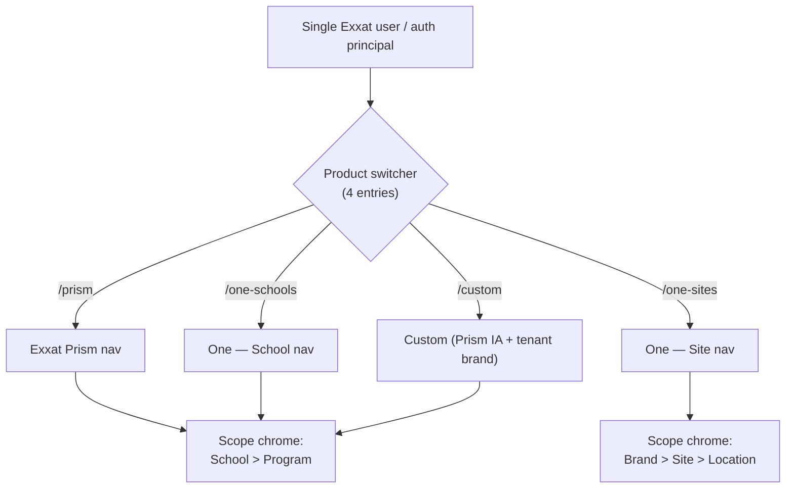

# Multi-product routing pattern

> Where it lives: the framework moved into the package on **`@exxatdesignux/ui@0.6.0`**.
>
> - Store, routing helpers, palette, brand registry, **product registry**
>   (`defineProduct`, `registerProducts`) → **`@exxatdesignux/product-framework`**
> - Routing-aware React shell (`<ProductProvider>`, `<ProductRootGate>`,
>   `<DefaultProductRedirect>`, `<ProductRouteSync>`, `useProduct`,
>   `useProductSwitch`, `useProductDashboardHref`) →
>   **`@exxatdesignux/ui/components/shell`**
>
> `apps/web/stores/app-store.ts` and `apps/web/contexts/product-context.tsx`
> are now thin **re-export shims** of those package entries; the same is true
> in `packages/ui/generated-starter` so new scaffolds get the canonical store the
> moment they land. Customer apps register their own products via
> [`registering-a-product.md`](./registering-a-product.md).

## Why this exists

Exxat ships **multiple products** (Prism, One — Schools, One — Sites, Custom)
under one shell. Without a routing model, switching from Exxat Prism to Exxat One leaves
the user on the same `/route` path, with the same sidebar, the same scope
chrome (school > program), and the same persisted filters — even though Prism
and One are different apps with different IAs, different scope hierarchies,
and different data. New hubs ship as if there is only one product, and any
"shared" state between products is accidental, not designed.

This doc defines:

1. The **switcher model** (which products are siblings, which scope hierarchy
   each one uses, what the active persona is).
2. The **URL shape** (subpath per product).
3. The **switch behaviour** (where you land, what happens to your state).
4. The **per-hub state isolation** rule (`persistKey` is product-namespaced).

It does **not** define the IA *inside* each product — that's per-product
design work that follows the senior-UX brief protocol like any other surface.

## The four-app model

The product switcher exposes **four entries** (not one). Exxat One ships as
**two siblings** because the School-side and Site-side experiences have
different navigation trees, different scope hierarchies, and different
primary personas — they're separate apps that share a corporate identity.
The fourth entry, **Custom**, is a tenant-configurable slot that inherits
Prism's IA wholesale (same routes, same nav, same scope hierarchy) but
recolours the chrome with a workspace-defined brand colour + wordmark
suffix configured in Settings → Appearance → Add product. Custom does not
ship with its own IA; it is Prism with a brand swap.

| Switcher entry | Product id | URL root | Scope chrome | Primary persona (`personas.md`) |
|---|---|---|---|---|
| Exxat Prism | `exxat-prism` | `/prism` | School > Program | Director of Clinical Education (DCE) / Placement Coordinator |
| Exxat One — Schools | `exxat-one-schools` | `/one-schools` | School > Program | DCE on the school side of partnerships |
| Exxat One — Sites | `exxat-one-sites` | `/one-sites` | Brand > Site > Location | Site Coordinator |
| Exxat Custom (tenant-branded Prism) | `exxat-custom` | `/custom` | School > Program | Same as Prism — tenant-configured branding only |

Four scope entities exist across the four apps: **School**, **Brand**, **Site**,
**Location**. Three of the four apps share the school > program hierarchy
(Prism, One — Schools, Custom); Exxat One — Sites is the only app with the
brand > site > location hierarchy.



## The four binding rules

### Rule 1 — URL shape: subpath per product

Every product owns a top-level URL root. Routes inside a product are scoped
under that root, not at the workspace root.

```
✓ /prism/dashboard
✓ /prism/library
✓ /one-sites/dashboard
✓ /one-sites/locations/loc_42
✓ /custom/dashboard
✓ /custom/library

✗ /dashboard            (which product?)
✗ /one/schools/...      (implies One is one app with sub-modes — it's not)
✗ /prism-dashboard      (subpath, not slug)
```

**URL roots use kebab-case sibling slugs** (`/one-schools`, `/one-sites`) — not
nested under a shared `/one` parent — because the two Exxat One apps are
siblings of Prism, not children of "One".

### Rule 2 — Switching products = hard redirect to that product's `/dashboard`

Clicking a product entry in the switcher:

1. Calls `setProduct(productId)` on the app store.
2. **Navigates to `/<product-root>/dashboard`** with `react-router-dom`'s
   `navigate(target, { replace: false })`.
3. Updates the `<html>` theme class (existing behaviour in
   [`ProductProvider`](../contexts/product-context.tsx)).

There is **no** semantic route mapping (e.g. `/prism/placements` does **not**
try to find a "placements" equivalent in Exxat One). There is **no** confirm
dialog on switch — the switch is cheap and reversible because the previous
product's state is preserved (rule 4). If the user has unsaved work, the
hub's own dirty-form guard (route blocker / dialog) catches it the same way
it would for any other navigation.

Direct visits to a route owned by a different product (e.g. typing
`/one-sites/library` while the switcher is on `exxat-prism`) **adopt** the
product implied by the URL: the app store updates `product` to match, the
theme class flips, and the page renders. The URL is the source of truth; the
switcher follows.

### Rule 3 — Each product has its own nav tree (and its own scope chrome)

[`apps/web/lib/mock/navigation.tsx`](../lib/mock/navigation.tsx) is a
**registry keyed by product id**, not a single flat array:

```ts
export const NAV_BY_PRODUCT: Record<Product, NavLinkItem[]> = {
  "exxat-prism":       buildSchoolFamilyPrimary("prism"),
  "exxat-one-schools": buildPlaceholderPrimary("one-schools"),
  "exxat-one-sites":   buildPlaceholderPrimary("one-sites"),
  // Custom inherits Prism's IA structurally — calls the same factory with
  // its own slug so the URLs anchor under `/custom/*` instead of sharing
  // an array reference with Prism.
  "exxat-custom":      buildSchoolFamilyPrimary("custom"),
}
```

`AppSidebar` reads `useProduct().product` and renders `NAV_BY_PRODUCT[product]`.
Within a product the nav is **stable** — switching schools/programs (Prism) or
brand/site/location (One — Sites) does **not** change the nav structure; only
the scope selector chrome (`TeamSwitcher` for Prism-family, a yet-to-be-built
`SiteSwitcher` for `exxat-one-sites`) shows the active selection.

The scope-chrome component itself is product-aware:

| Product | Scope chrome component | Levels |
|---|---|---|
| `exxat-prism`, `exxat-one-schools`, `exxat-custom` | `TeamSwitcher` (existing) | School > Program |
| `exxat-one-sites` | `SiteSwitcher` (to build) | Brand > Site > Location |

### Rule 4 — `persistKey` is product-namespaced

Today, two consumers of the same `LibraryTable` already use distinct
`persistKey` values to avoid storage-slot collisions
([`persisted-state-pattern.md`](./persisted-state-pattern.md)). The same rule
applies across products:

```
✓ persistKey={productPersistKey(product, "library")}
  // → "prism:library"   when product === "exxat-prism"
  // → "one-sites:library" when product === "exxat-one-sites"
  // → "custom:library"  when product === "exxat-custom"

✗ persistKey="library"
  // shared across all four apps — Prism filters leak into One / Custom
```

The compose helper lives in [`apps/web/stores/app-store.ts`](../stores/app-store.ts)
(next to the `Product` union — different consumer apps can have different
unions, so the typed helper stays in the app, not the shared UI package):

```ts
export function productPersistKey(product: Product, hubKey: string): string {
  return `${productSlug(product)}:${hubKey}`
}
```

After the DS-wide `exxat-ds:` namespace from
[`packages/ui/src/lib/persisted-state.ts`](../../../packages/ui/src/lib/persisted-state.ts),
the full localStorage key for a Prism library filter slot is
`exxat-ds:prism:library` — three layers: DS-namespace, product slug,
hub key.

State is **preserved within a product across switches** (Prism → One → Prism
finds Prism's library filters intact). State **never crosses products**,
because the storage slot for each product is independent.

Rule of thumb for hub authors: any `persistKey` you put on `<HubTable>` or
`<ListPageTemplate>` MUST go through `productPersistKey()`. The legacy
unscoped key only stays valid for **shell-global** state (theme, sidebar
collapsed, coach-mark dismissals) — those continue to use the bare keys
documented in [`persisted-state-pattern.md`](./persisted-state-pattern.md).

## Cross-product surfaces

Some surfaces span products by design — a Prism slot offer that lands in a
One — Sites coordinator's inbox, a partnership invitation that originates in
One — Sites and resolves in Prism. These are **deliberate cross-product flows**
and follow three rules:

1. The brief explicitly names **both** products (and both scope hierarchies)
   under `Product:` / `Scope:` per
   [`exxat-product-context.mdc`](../../../.cursor/rules/exxat-product-context.mdc).
2. The surface lives **inside one product's URL** (the one that owns the
   action). The other product appears as **read-only context** with a clearly
   labelled affordance (`View in Exxat One — Sites →`) that does a hard switch
   per Rule 2.
3. The `persistKey` (if any) namespaces under the **owning** product, not a
   shared "cross-product" slot. Cross-product state lives in server-side data,
   not in `localStorage`.

What's **not** in scope yet (separate, future PRs):

- Cross-product deep linking (a saved Prism placement that links straight to
  a One — Sites location detail).
- Cross-product `⌘K` results (today the palette is single-product).
- Cross-product notifications inbox.

## What this doc does **not** cover (deliberately)

- **The IA inside each product.** That's per-product design work — each app
  defines its own `NAV_*` array, its own dashboards, its own hubs, following
  the existing senior-UX brief protocol.
- **The migration path** for existing Prism routes from `/<route>` to
  `/prism/<route>`. That's a separate refactor with its own redirect strategy
  (HTTP 308 from old to new for any route shipped before this model).
- **Server-side RBAC enforcement.** This doc enforces *visibility* in the
  client; the API layer enforces authorization. A user who types
  `/one-sites/...` without the right role gets a 403 from the server, not a
  client-side route guard.
- **The `SiteSwitcher` component** for Brand > Site > Location selection.
  That's a separate primitive that lives next to `TeamSwitcher` in
  [`apps/web/components/sidebar/`](../components/sidebar) once `exxat-one-sites`
  is being built.

## See also

- [`.cursor/rules/exxat-product-routing.mdc`](../../../.cursor/rules/exxat-product-routing.mdc) — binding rule
- [`.cursor/rules/exxat-product-context.mdc`](../../../.cursor/rules/exxat-product-context.mdc) — brief format (`Product:` / `Scope:` / `Persona:` lines)
- [`apps/web/docs/agent-context/README.md`](./agent-context/README.md) — scope and persona reference
- [`apps/web/docs/persisted-state-pattern.md`](./persisted-state-pattern.md) — `persistKey` rules
- [`apps/web/components/product-switcher.tsx`](../components/product-switcher.tsx) — runtime entry point
- [`apps/web/stores/app-store.ts`](../stores/app-store.ts) — `Product` union and persistence
